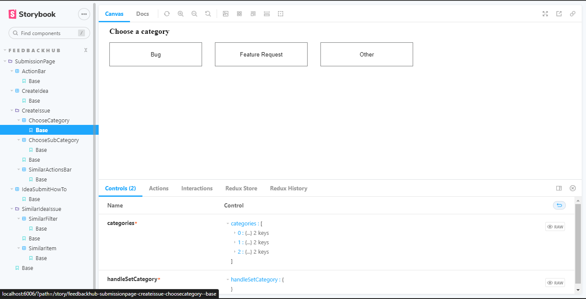

# Storybook setup

## feedbachHub/SubmissionPage
- Stories for components under <br> ```/fed-src/app-src/routes/feedbackHub/Components/SubmissionPage```

- 
- The above screenshot shows an outline of all the stories created under the SubmissionPage, from the tabpanel to the left. The Currently open story is highlighted in blue. The storybook panel on the right shows the storybook for the currently open story.
